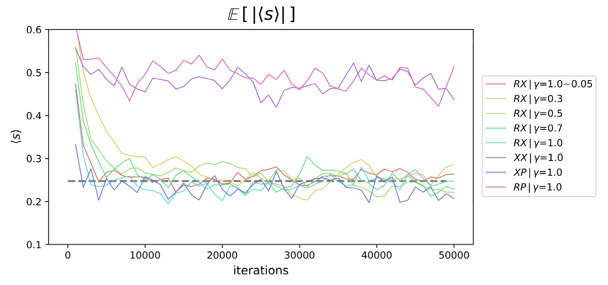
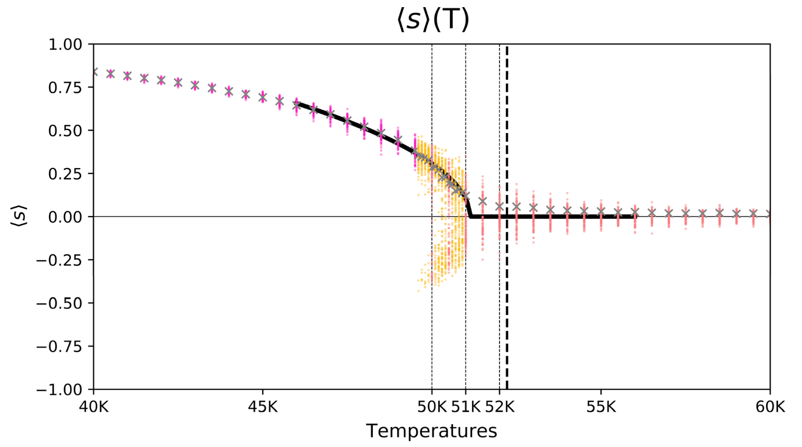

# Parallel Ising Model Simulation in C (2D & 3D)

[](https://en.wikipedia.org/wiki/C_(programming_language))
[](https://www.openmp.org/)
[](https://opensource.org/licenses/MIT)

A high-performance C implementation of the Metropolis algorithm for simulating 2D and 3D Ising models. This project optimizes computational efficiency on multi-core systems using OpenMP parallelization.

### Key Features

- **High-Performance C:** Low-level implementation for maximum simulation speed.
- **OpenMP Parallelization:** Parallelizes computationally intensive spin updates and magnetization calculations. Uses a **checkerboard update scheme** to resolve data dependencies, ensuring thread safety without locking overhead.
- **2D & 3D Support:** Configurable for both 2D square and 3D cubic lattices.
- **Metropolis Algorithm:** Implements the classic Metropolis-Hastings algorithm to simulate phase transitions.
- **Quality Randomness:** Integrates the MT19937-64 (Mersenne Twister) generator for high-quality stochastic simulation.

### Methodology and Key Findings

This project numerically determines the Curie temperature of the 3D Ising model through a rigorous two-stage process:

1.  **Validation (2D):** Benchmarking against exact analytical solutions to identify optimal simulation parameters.
2.  **Estimation (3D):** Applying the validated methodology to a `25x25x25` 3D lattice using Least Chi-Square Fitting.

---

### 1. Validation on 2D Lattice: Finding the Optimal Method

To ensure physical and statistical validity, the simulation framework was first benchmarked against the exact analytical solution for the 2D square lattice (Onsager, 1944; Yang, 1952).

Experiments at the near theoretical critical temperature (26.3335K, where $T_c \approx 26.333575$ K) tested various conditions:
- **Update Order:** Random (`R-`) vs. Fixed (`X-`).
- **Boundary Conditions:** Periodic (`-P`) vs. Non-periodic (`-X`).
- **Damping ($\gamma$):** Dynamic adjustment of acceptance rates to control convergence.


*   **Figure:** Evolution of average absolute magnetization $\mathbb{E}[|\langle s \rangle|]$ over 50,000 iterations. Colored lines represent averages of 50 chains; the dashed gray line is the theoretical value (~0.2477).

#### Key Observations:
- **Boundary Conditions:** Simulations **without periodic boundaries (`-X`)** converged significantly closer to the theoretical value, whereas periodic boundaries caused overestimation due to finite-size effects.
- **Optimal Configuration:** The **'Random update, Non-periodic'** setup with dynamic damping ($\gamma$: 1.0 $\to$ 0.05) proved most robust.
- **Statistical Estimator:** Using the **average of absolute magnetization** ($\mathbb{E}[|\langle s \rangle|]$) was confirmed as the reliable estimator to handle spontaneous symmetry breaking.

---

### 2. Key Result: 3D Phase Transition and Curie Temperature

Applying the validated 'RX' method to a 3D cubic lattice, the simulation successfully captures the ferromagnetic-paramagnetic phase transition.



*   **Figure:** Simulated magnetization $\langle s \rangle$ vs. Temperature $T$ on a `25x25x25` 3D lattice.
    *   **Points:** Final magnetization from individual runs (pink/orange/red indicate different batches).
    *   **Gray 'x':** Average absolute magnetization.
    *   **Solid Line:** Curve derived from **Least Chi-Square Fitting** on equation: $f(T;\alpha,T_c) = \alpha \sqrt{3(1-T/T_c)} \mathbb{1}_{T < T_c}$.
    *   *(Note: Least Chi-Square Fitting was chosen to weigh data points by their inverse variance, ensuring the fit is driven by statistically reliable data.)*

#### Analysis:
- The estimated Curie Temperature $T_c$ is **51.13 K**.
- This aligns closely with the established literature value of **~52.2 K** [3,4], demonstrating the simulation's high accuracy given the lattice size.
- The deviation (~2.1%) is primarily attributed to **finite-size effects** inherent to the $25^3$ lattice and the statistical bias from averaging absolute magnetization. Future improvements could utilize **Binder Cumulants** on larger lattices to mitigate these effects.
---

### How to Build and Run

Requires a C compiler with OpenMP support (e.g., `gcc`, `clang`).

#### 1. Compile
The `-fopenmp` flag is essential for parallelization.

```bash
# Using gcc
gcc -o ising_simulation main.C random.C -fopenmp -lm
```

#### 2. Run
```bash
./ising_simulation
```
Output files (e.g., `3d_metro_0.txt`) containing magnetization data will be generated in the current directory.

### References
[1] L. Onsager. (1944). Crystal Statistics. I. A Two-Dimensional Model with an Order-Disorder Transition, Phys. Rev, Volume 65, Issue 3-4, Pages 117-149.\
[2] Yang, C. N. (1952). The Spontaneous Magnetization of a Two-Dimensional Ising Model: Phys.Rev. Volume 85, Issue 5, Pages 808-816\
[3] Sonsin, Artur & Cortes, Mariane & Nunes, D & Gomes, J & Costa, R. (2015). Computational Analysis of 3D Ising Model Using Metropolis Algorithms. Journal of Physics: Conference Series.\
[4] E.Z. Meilikhov, R.M. Farzetdinova (2006). Curie temperature for Small World Ising systems of different dimensions, Journal of Magnetism and Magnetic Materials, Volume 300, Issue 1, Pages 254-256.
